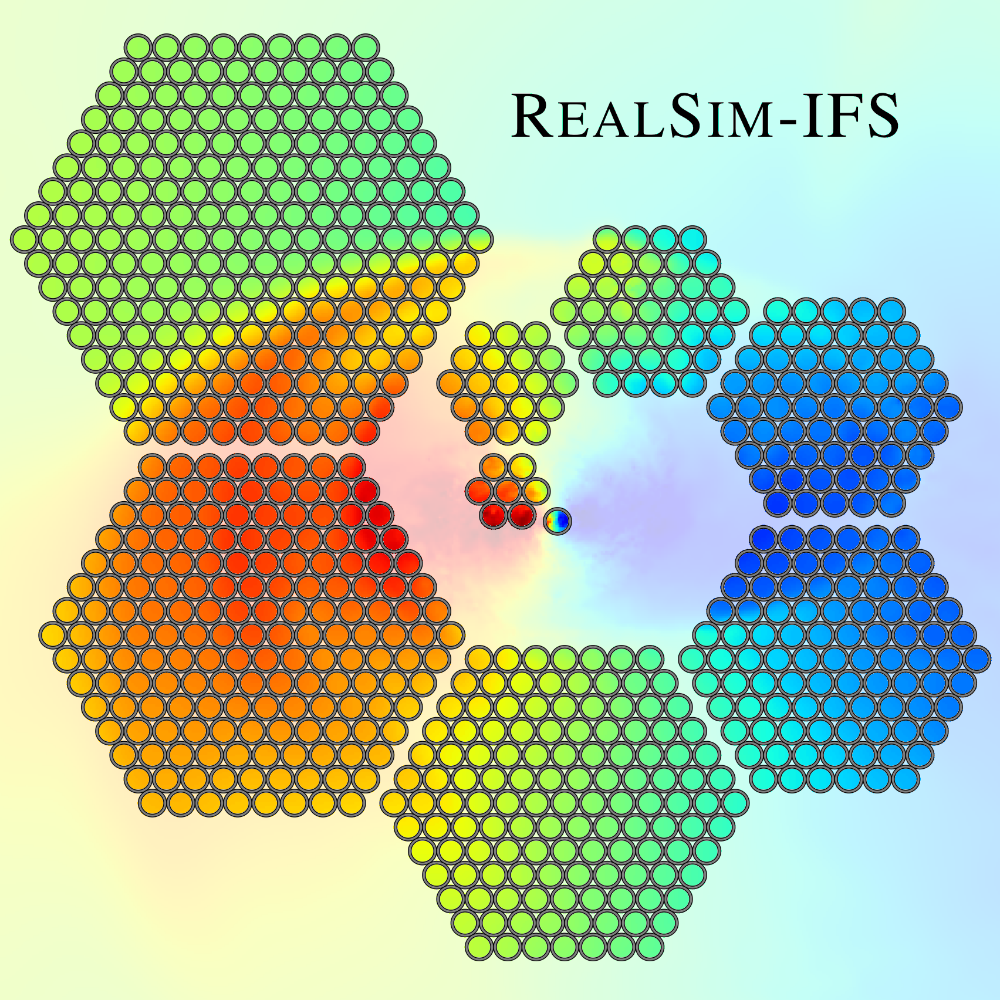

RealSim-IFS is a Python tool for generating survey-realistic integral-field spectroscopy (IFS) obvervations of galaxies from numerical simulations of galaxy formation. The tool is designed primarily to emulate current and experimental observing strategies for IFS galaxy surveys in astronomy. RealSim-IFS has built-in functions supporting SAMI and MaNGA IFU footprints, but supports any fiber-based IFU design, in general.

The code is documented and demonstrated in Bottrell & Hani 2022 ([MNRAS 514 2821](https://doi.org/10.1093/mnras/stac1532)) [[arxiv](https://arxiv.org/abs/2205.15335)][[acsl](https://ascl.net/2206.022)]. If you use RealSim-IFS in your research, we would be grateful for citation of the MNRAS publication. 

## Installation

RealSim-IFS is not a pypy package. The github repository can be cloned to your Python environment's path. By convention, it should be placed in the `site-packages` directory of your Python environment. For example, with a conda environment active:
```
conda activate my_env
cd $CONDA_PREFIX/lib/pythonX.x/site-packages
git clone https://github.com/cbottrell/realsim_ifs.git
```
Where X.x is the Python version for the environment. That's it!

Your version of RealSim-IFS can be updated by going into the cloned directory and pulling changes from github. For example:
```
cd $CONDA_PREFIX/lib/pythonX.x/site-packages/realsim_ifs
git pull
```
If you encounter issues/bugs, please try the most recent version of RealSim-IFS. If the bug persists, please do not hesitate to contact me.

## Tutorial

A Jupyter notebook [tutorial](https://github.com/cbottrell/realsim_ifs/blob/master/Tutorials/IFS/Tutorial.ipynb) using RealSim-IFS to make [SDSS-IV MaNGA](https://www.sdss.org/instruments/) stellar kinematics for a [TNG50-1](https://www.tng-project.org/) disk galaxy is included with the package (along with the input datacube). It can be found here: `Tutorials/IFS/Tutorial.ipynb`.

## Precision

RealSim-IFS can reproduce both the flux and variance propagation of real galaxy spectra to cubes. The [precision](https://github.com/cbottrell/realsim_ifs/blob/master/Tutorials/IFS/Precision.ipynb) notebook uses real calibrated fiber spectra from the MaNGA survey to generate flux and variance cubes that are identical to those produced by the MaNGA data reduction pipeline.
